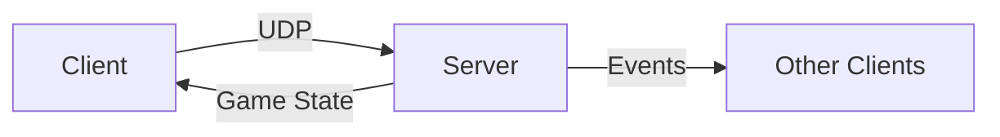
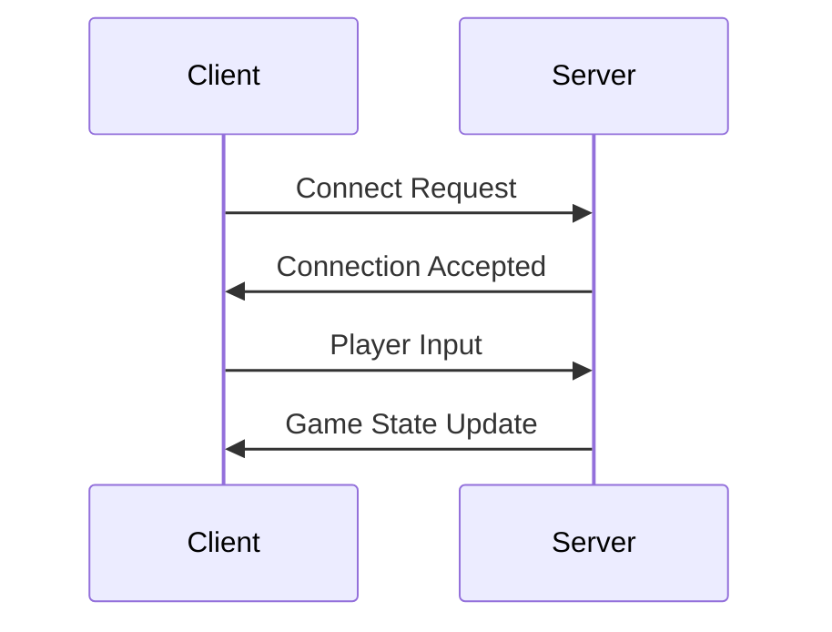
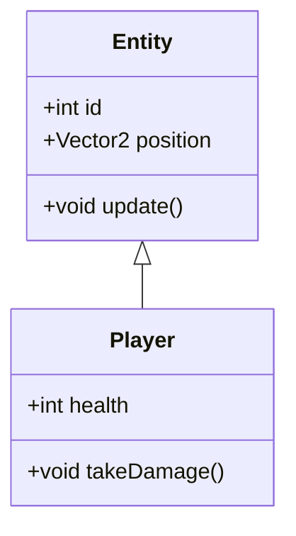
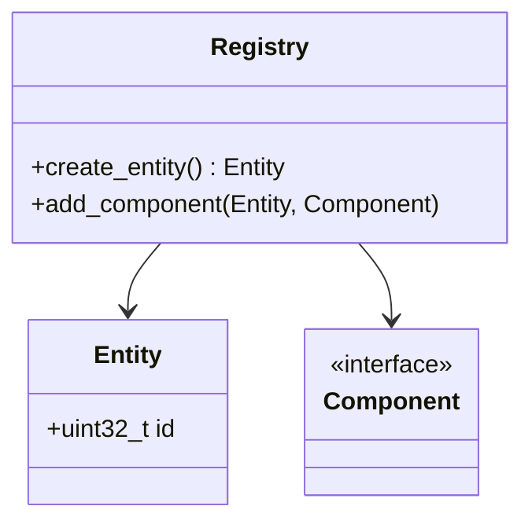

# Contributing to R-Type Documentation

This guide explains how to add and organize documentation for the R-Type project. Documentation is automatically deployed to ReadTheDocs on every push to the main branch.

## Table of Contents

1. [Project Structure](#project-structure)
2. [Adding a New Page](#adding-a-new-page)
3. [Routing System (Navigation)](#routing-system-navigation)
4. [Markdown Syntax](#markdown-syntax)
5. [Advanced Features](#advanced-features)
6. [Contribution Workflow](#contribution-workflow)

---

## Project Structure

```
R-Type/
├── mkdocs.yml           # Main configuration
└── docs/                # 📁 All documentation files go here
    ├── index.md         # Homepage
    ├── contributing.md
    ├── requirements.txt # Python dependencies
    ├── extra.css        # Custom CSS styles
    ├── getting-started/
    │   ├── index.md
    │   └── install.md
    ├── guide/
    │   ├── basics/
    │   └── advanced/
    └── api/
        └── reference.md
```

**⚠️ Important**: All your Markdown files must be in the `docs/` folder.

---

## Adding a New Page

### Step 1: Create the Markdown File

Create a new `.md` file in the appropriate folder:

```bash
# Example: Add a page about network protocol
touch docs/architecture/protocol.md
```

### Step 2: Write the Content

Edit the file with your content:

```markdown
# Network Protocol

This document describes the UDP communication protocol used by R-Type.

## Overview

The protocol is binary and UDP-based...

## Packet Structure

### Connection Packet

| Field | Type  | Size   | Description |
|-------|-------|--------|-------------|
| ID    | uint8 | 1 byte | Identifier  |
| ...   | ...   | ...    | ...         |
```

### Step 3: Add the Page to Navigation

Open `mkdocs.yml` and add your page to the `nav` section:

```yaml
nav:
  - Home: index.md
  
  - Architecture:
    - architecture/index.md
    - Protocol: architecture/protocol.md  # ← Your new page
    - Server: architecture/server.md
```

### Step 4: Commit and Push

Once your changes are made, commit and push:

```bash
git add docs/architecture/protocol.md mkdocs.yml
git commit -m "docs: add network protocol documentation"
git push
```

**ReadTheDocs will automatically rebuild the documentation** and it will be available in a few minutes at `https://eliestroun14.github.io/R-Type/`

---

## Routing System (Navigation)

Routing defines how pages appear in the sidebar menu. Everything is configured in `mkdocs.yml` under the `nav` section.

### Basic Syntax

```yaml
nav:
  - Displayed Title: path/to/file.md
```

### Structure Types

#### 1. Simple Page

```yaml
nav:
  - Home: index.md
  - Contributing: contributing.md
```

**Result**: Two links at the same level in the sidebar.

---

#### 2. Section with Sub-pages

```yaml
nav:
  - Getting Started:
    - Installation: getting-started/install.md
    - Configuration: getting-started/config.md
```

**Result**: "Getting Started" section in **bold** (expandable) containing 2 sub-pages.

> **💡 Why bold?** The `navigation.sections` feature automatically bolds sections containing sub-pages to improve readability.

---

#### 3. Section with Index Page

```yaml
nav:
  - API Reference:
    - api/index.md          # Page displayed when clicking "API Reference"
    - Classes: api/classes.md
    - Functions: api/functions.md
```

**Result**: Clicking "API Reference" displays `api/index.md`, while still providing access to sub-pages.

> **⚠️ Important**: Requires the `navigation.indexes` feature (already enabled in our config).

---

#### 4. Nested Sections (Multi-level)

```yaml
nav:
  - Documentation:
    - Getting Started:
      - docs/getting-started/index.md
      - Installation: docs/getting-started/install.md
    - Advanced Topics:
      - Architecture: docs/advanced/architecture.md
      - Performance: docs/advanced/performance.md
```

**Result**: Multi-level hierarchy with sections and sub-sections.

---

#### 5. External Link

```yaml
nav:
  - GitHub: https://github.com/eliestroun14/R-Type
  - Report Bug: https://github.com/eliestroun14/R-Type/issues
```

**Result**: Clickable links that open in a new tab.

---

### Complete Navigation Example

```yaml
nav:
  # Homepage
  - Home: index.md
  
  # Simple section
  - Contributing: contributing.md
  
  # Section with index and sub-pages
  - Getting Started:
    - getting-started/index.md
    - Installation: getting-started/install.md
    - Configuration: getting-started/config.md
  
  # Section with sub-sections
  - Architecture:
    - architecture/index.md
    - Client:
      - Overview: architecture/client/overview.md
      - Rendering: architecture/client/rendering.md
    - Server:
      - Overview: architecture/server/overview.md
      - Networking: architecture/server/networking.md
    - Protocol: architecture/protocol.md
  
  # Simple section with multiple pages
  - API Reference:
    - api/index.md
    - Classes: api/classes.md
    - Functions: api/functions.md
  
  # External links
  - GitHub: https://github.com/eliestroun14/R-Type
```

---

### Routing Best Practices

#### ✅ DO

1. **Organize logically**: Group pages by theme
2. **Folder structure = navigation structure**:

   ```
   docs/
   ├── getting-started/
   │   ├── index.md
   │   └── install.md
   └── architecture/
       ├── index.md
       └── protocol.md
   ```

3. **Use index.md for important sections**:

   ```yaml
   - Architecture:
     - architecture/index.md  # Overview
     - Protocol: architecture/protocol.md
   ```

4. **Clear and descriptive names**:

   ```yaml
   - Network Protocol: architecture/protocol.md  # ✅ Clear
   ```

#### ❌ DON'T

1. **Paths too deep**: Maximum 3-4 levels
2. **Redundant names**:

   ```yaml
   - Architecture:
     - Architecture Overview: architecture/overview.md  # ❌ "Architecture" repeated
   ```

3. **Orphan pages**: Every important page should be in the `nav`

---

## Markdown Syntax

### Headings

```markdown
# Heading Level 1 (H1) - Use only once at the top of the page
## Heading Level 2 (H2) - Main sections
### Heading Level 3 (H3) - Sub-sections
#### Heading Level 4 (H4) - Details
```

### Formatted Text

```markdown
**Bold text**
*Italic text*
***Bold and italic***
`inline code`
~~Strikethrough~~
```

### Lists

```markdown
<!-- Bullet list -->
- Item 1
- Item 2
  - Sub-item 2.1
  - Sub-item 2.2
- Item 3

<!-- Numbered list -->
1. First step
2. Second step
3. Third step

<!-- Task list -->
- [x] Completed task
- [ ] In progress task
- [ ] Todo task
```

### Links

```markdown
[Link text](https://example.com)
[Link to another page](../other-page.md)
[Link to a section](#section-title)
```

### Images

```markdown


```

### Tables

```markdown
| Column 1 | Column 2 | Column 3 |
|----------|----------|----------|
| Value 1  | Value 2  | Value 3  |
| Value 4  | Value 5  | Value 6  |

<!-- Alignment -->
| Left   | Center | Right |
|:-------|:------:|------:|
| A      |   B    |     C |
```

### Code

````markdown
<!-- Inline code -->
The `main()` function is the entry point.

<!-- Code block without syntax highlighting -->
```
Code without specified language
```

<!-- Code block with syntax highlighting -->
```cpp
#include <iostream>

int main() {
    std::cout << "Hello, R-Type!" << std::endl;
    return 0;
}
```

<!-- Code with line numbers (automatic with our config) -->
```python
def calculate_damage(base_damage, multiplier):
    return base_damage * multiplier

damage = calculate_damage(10, 1.5)
print(f"Damage dealt: {damage}")
```
````

### Blockquotes

```markdown
> This is a quote.
> It can span multiple lines.

> **Note**: Quotes can contain formatting.
```

### Separators

```markdown
Text before

---

Text after (separated by horizontal line)
```

---

## Advanced Features

### Admonitions (Alert Boxes)

Admonitions allow you to highlight important information:

```markdown
!!! note
    This is an informative note.

!!! warning
    Warning: This is a warning!

!!! danger
    Danger! Critical information.

!!! tip
    Tip: Useful advice for developers.

!!! info
    Additional information.

!!! success
    Operation successful!

!!! question
    Frequent question or point of reflection.

!!! example
    Code or usage example.
```

**Collapsible Admonitions**:

```markdown
??? note "Custom title (click to expand)"
    Content hidden by default.

???+ warning "Expanded by default"
    Content visible by default but collapsible.
```

---

### Tabs

Useful for showing multiple options (e.g., different OS, languages, etc.):

```markdown
=== "C++"
    ```cpp
    std::cout << "Hello" << std::endl;
    ```

=== "Python"
    ```python
    print("Hello")
    ```

=== "JavaScript"
    ```javascript
    console.log("Hello");
    ```
```

---

### Mermaid Diagrams

Create diagrams directly in Markdown:

````markdown





````

**Available diagram types**:

- `graph`: Flow diagrams
- `sequenceDiagram`: Sequence diagrams
- `classDiagram`: Class diagrams
- `stateDiagram`: State diagrams
- `erDiagram`: Entity-relationship diagrams
- `gantt`: Gantt charts

---

### Code Annotations

```markdown
``` cpp
#include <iostream>  // (1)

int main() {
    std::cout << "Hello"; // (2)
    return 0;  // (3)
}
```

1. Include standard library
2. Display a message
3. Program return

```

---

### Include Content from Other Files

With the `include-markdown` plugin, you can include content from other files:

```markdown
<!-- Include entire file -->
{!docs/snippets/common-section.md!}

<!-- Include specific section -->
{!docs/snippets/install.md!}
```

Useful to avoid content duplication!

---

## Contribution Workflow

### 1. Plan Your Documentation

Before writing, ask yourself:

- **Who** will read this page? (beginner, experienced developer, game designer...)
- **What** needs to be explained? (concept, tutorial, API reference...)
- **Where** to place this page in the navigation?

### 2. Create the Structure

```bash
# Create folder if necessary
mkdir -p docs/architecture/client

# Create file
touch docs/architecture/client/rendering.md
```

### 3. Write the Content

Recommended structure for a page:

```markdown
# Page Title

Brief introduction in 1-2 sentences explaining the topic.

## Overview

General description of the concept.

## Technical Details

In-depth explanation with code examples.

## Examples

Concrete use cases.

## References

Links to other pages or external resources.
```

### 4. Add to Routing

Edit `mkdocs.yml`:

```yaml
nav:
  - Architecture:
    - architecture/index.md
    - Client:
      - Overview: architecture/client/overview.md
      - Rendering: architecture/client/rendering.md  # ← New page
```

### 5. Commit and Push

```bash
git add docs/architecture/client/rendering.md mkdocs.yml
git commit -m "docs: add client rendering documentation"
git push origin main
```

**ReadTheDocs will automatically rebuild** the documentation in a few minutes!

---

## Tips and Best Practices

### ✅ DO

1. **Descriptive titles**: `# Network Protocol` rather than `# Protocol`
2. **One idea per section**: Break down long sections
3. **Code examples**: Always illustrate with concrete examples
4. **Internal links**: Connect pages together
5. **Table of contents**: For long pages, add a TOC at the beginning

### ❌ DON'T

1. **Don't duplicate content**: Use links or `include-markdown`
2. **Avoid dead links**: Verify files exist
3. **No absolute paths**: Use relative paths
4. **Don't overuse formatting**: Too much bold/italic hurts readability

---

## Example Page Types

### Tutorial Page

```markdown
# Client Installation

This guide walks you through installing and configuring the R-Type client.

## Prerequisites

- CMake 3.20+
- Conan 2.0+
- C++20 compiler

## Installation Steps

### 1. Clone the Repository

```bash
git clone https://github.com/eliestroun14/R-Type.git
cd R-Type
```

### 2. Install Dependencies

```bash
conan install . --build=missing
```

### 3. Build the Project

```bash
cmake --preset conan-default
cmake --build --preset conan-release
```

## Verification

Launch the client:

```bash
./build/Release/r-type-client
```

You should see the game window open.

## Common Issues

??? question "Compilation error with SFML"
    Verify that Conan correctly installed SFML:
    ```bash
    conan list sfml
    ```

## Next Steps

- [Client Configuration](configuration.md)
- [Connecting to Server](../server/connection.md)

```

### API Reference Page

```markdown
# Entity Component System (ECS)

The ECS is the core of our game engine.

## Overview

Our implementation uses an ECS pattern where:
- **Entities**: Unique identifiers (ID)
- **Components**: Pure data (POD)
- **Systems**: Processing logic

## API

### Registry

```cpp
class Registry {
public:
    Entity create_entity();
    void destroy_entity(Entity entity);
    
    template<typename Component>
    Component& add_component(Entity entity, Component component);
    
    template<typename Component>
    Component& get_component(Entity entity);
};
```

#### Usage Example

```cpp
Registry registry;

// Create entity
Entity player = registry.create_entity();

// Add components
registry.add_component(player, Position{100, 100});
registry.add_component(player, Velocity{5, 0});
registry.add_component(player, Sprite{"player.png"});
```

## Class Diagram



## See Also

- [Creating a New System](creating-systems.md)
- [Available Components](components-reference.md)

```

---

## Support

If you have questions about documentation:

1. **Open an issue** on GitHub with the `documentation` label
2. **Ask in the channel** `#documentation` on Discord
3. **Check examples** in existing pages

Happy documenting! 📚
